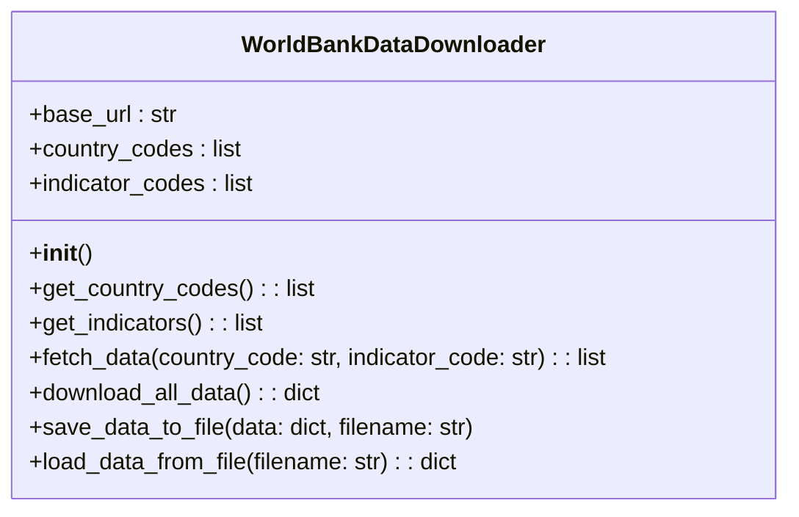
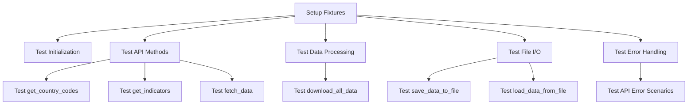

[](https://codecov.io/gh/arturogonzalezm/world_bank_data)
[](https://github.com/arturogonzalezm/world_bank_data/actions/workflows/workflow.yml)
[](https://opensource.org/licenses/MIT)

# World Bank Data Downloader

This project provides a Python class `WorldBankDataDownloader` for downloading data from the World Bank API. It includes functionality to fetch country codes, indicator codes, and data for specific country-indicator pairs.

## Class Structure

The `WorldBankDataDownloader` class is structured as follows:



## Key Features

1. **Retry Mechanism**: Uses the `tenacity` library to implement retry logic for API requests.
2. **Pagination Handling**: Manages paginated responses from the World Bank API.
3. **Rate Limiting**: Implements delays between requests to avoid overwhelming the API.
4. **Error Handling**: Robust error handling for API requests and data processing.
5. **Data Persistence**: Methods to save and load data to/from JSON files.

## Usage

Here's a basic example of how to use the `WorldBankDataDownloader`:

```python
downloader = WorldBankDataDownloader()
all_data = downloader.download_all_data()
downloader.save_data_to_file(all_data, 'world_bank_data.json')
```

## Unit Tests

The project includes a comprehensive suite of unit tests using pytest. The test structure is as follows:



### Test Coverage

The unit tests cover:

1. Class initialization
2. API interaction methods (with mocked responses)
3. Data processing logic
4. File I/O operations
5. Error handling scenarios

### Running the Tests

To run the tests:

1. Ensure you have pytest installed: `pip install pytest`
2. Run the command: `pytest test_world_bank_data_downloader.py`

## Dependencies

- requests
- tenacity
- pytest (for running tests)

## Notes

- The World Bank API has rate limits. The class implements a basic delay between requests, but for large-scale data fetching, you may need to implement more sophisticated rate limiting.
- Always check the World Bank API documentation for the most up-to-date information on endpoints and usage guidelines.

## License

This project is licensed under the MIT License. See the [LICENSE](LICENSE) file for details.
